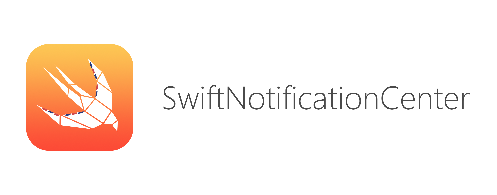

 
 

 

A Protocol-Oriented NotificationCenter which is type safe, thread safe and with memory safety.

- Type Safe

	No more `userInfo` dictionary and Downcasting, just deliver the concrete type value to the observer.
	
- Thread Safe

	You can `register`, `notify`, `unregister` in any thread without crash and data corruption.
	
- Memory Safety

	 `SwiftNotificationCenter` store the observer as a zeroing-weak reference. No crash and no need to `unregister` manually.
		
It's simple, safe, lightweight and easy to use for `one-to-many` communication.

## Usage

Define protocol and observer:

~~~swift
protocol Update {
    func updateTitle(title: String)
}

extension ViewController: Update {
  func updateTitle(title: String) {
  		self.titleLabel.text = title
  }
}
let vc = ViewController()
~~~

Register:

~~~swift
Broadcaster.register(Update.self, observer: vc)
~~~

Broadcast:

~~~swift
Broadcaster.notify(Update.self) {
    $0.updateTitle("new title")
}
~~~

Unregister:

~~~swift
Broadcaster.unregister(Update.self, observer: self)
~~~

 

Compare with `NSNotificationCenter` :

For example, handle `UIKeyboardWillShowNotification`

~~~swift
@objc func handleKeyboardNotification(notification: NSNotification) {
    guard notification.name == NSNotification.Name.UIKeyboardWillShow
        else { return }
    
    guard let beginFrame = (notification
        .userInfo?[UIKeyboardFrameBeginUserInfoKey] as? NSValue)?.cgRectValue
        else { return }
    
    guard let endFrame = (notification
        .userInfo?[UIKeyboardFrameEndUserInfoKey] as? NSValue)?.cgRectValue
        else { return }
    // use beginFrame, endFrame
}
~~~

`SwiftNotificationCenter` way:

~~~swift
/*
If you want to observe the system built in notifications like this.
You can declare a protocol and the relevant method, and use a singleton as a mediator to observe system's notification, then notify our observers.
Please check the refactor example in SwiftNotificationCenterExample Project.
*/
func UIKeyboardWillShow(beginFrame: CGRect, endFrame: CGRect) {
}
~~~

## Installation

CocoaPods:

~~~
pod 'SwiftNotificationCenter'
~~~

Carthage:

~~~
github "100mango/SwiftNotificationCenter"
~~~

Manually: 

Just copy source files in the SwiftNotificationCenter folder into your project.

## License

`SwiftNotificationCenter` is under the MIT license.
